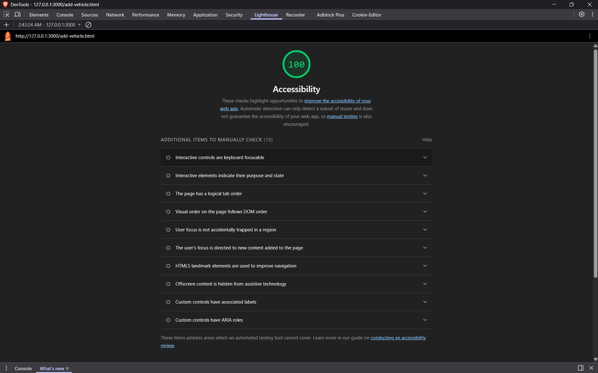
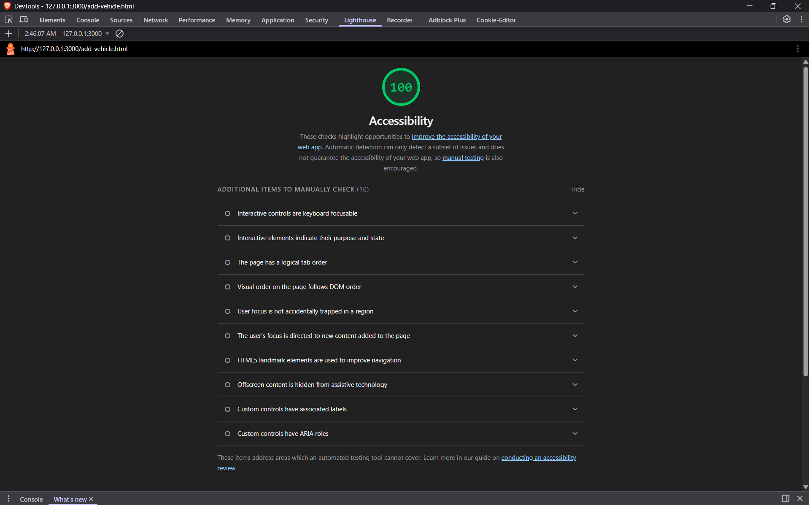

# COMP1004 Coursework

## HTML

The website has three HTML pages:

- `index.html` — People Search
- `vehicle.html` — Vehicle Search
- `add-vehicle.html` — Add a Vehicle

Each page includes:

- header
- main
- aside
- footer
- navigation links inside a `<ul>`
- sidebar image

Accessibility was improved by using:

- labels for form inputs
- alt text for images
- clear headings
- larger navigation links for touch targets

Lighthouse screenshots for the Add Vehicle page:

## CSS

All pages use the same external CSS file:

- `style.css`

The CSS includes:

- flexbox for the navigation menu
- grid layout for the page structure
- border, margin and padding for header, main, aside and footer
- media query for screens below 500px

Responsive layout code is in:

- `style.css`

## JavaScript

JavaScript code is in:

- `app.js`

It includes:

- people search
- vehicle search
- add vehicle
- add owner
- reset database

## Database

The website connects to Supabase using:

- `config.js`

The database has two tables:

- People
- Vehicles

The reset button restores the database to the original records.

## Testing

Additional Playwright tests are in:

- `tests/add-vehicle-extra.spec.js`

The tests check:

- successful vehicle and owner entry
- missing owner details
- missing vehicle details
- duplicate owner details
